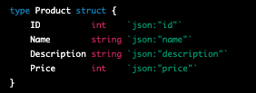

# FTGO-P2-V1-SLC1

## RULES
1. **Untuk kampus remote**: **WAJIB** melakukan **share screen**(**DESKTOP/ENTIRE SCREEN**) dan **unmute microphone** ketika Live Code
berjalan (tidak melakukan share screen/salah screen atau tidak unmute microphone akan di ingatkan).
2. Kerjakan secara individu. Segala bentuk kecurangan (mencontek ataupun diskusi) akan menyebabkan skor live code ini 0.
3. Clone repo ini kemudian buatlah **branch dengan nama kalian**.
4. Kerjakan pada file Golang (\*.go) yang telah disediakan.
5. Waktu pengerjaan: **90 menit** untuk **2 soal**.
6. **Pada text editor hanya ada file yang terdapat pada repository ini**.
7. Membuka referensi eksternal seperti Google, StackOverflow, dan MDN diperbolehkan.
8. Dilarang membuka repository di organisasi tugas, baik pada organisasi batch sendiri ataupun batch lain, baik branch sendiri maupun branch orang
lain (**setelah melakukan clone, close tab GitHub pada web browser kalian**).
9. Lakukan `git push origin <branch-name>` dan create pull request **hanya jika waktu Live Code telah usai (bukan ketika kalian sudah selesai
mengerjakan)**. Tuliskan nama lengkap kalian saat membuat pull request dan assign buddy.
10. **Penilaian berbasis logika dan hasil akhir**. Pastikan keduanya sudah benar.

## Notes
Live code ini memiliki bobot nilai sebagai berikut:

|Criteria|Meet Expectations|Points|
|---|---|---|---|---|
|Problem Solving|5 API Endpoints are implemented and working correctly |15 pts |
|   |4 API Endpoints are implemented and working correctly |15 pts |
|   |3 API Endpoints are implemented and working correctly |15 pts |
|   |2 API Endpoints are implemented and working correctly |15 pts |
|   |1 API Endpoints are implemented and working correctly |15 pts |
|Database Design |MySQL database meets the required specifications |10 pts|
||Database queries are efficient and appropriately indexed |5 pts|
|Readability|Code is well-documented and easy to read |5 pts|
||Code includes appropriate comments and documentation |5 pts|

####KETENTUAN
Here are some dos and don'ts to consider when working on this livecode:

Dos:

- Do read and understand the problem statement and requirements carefully before starting to code.
- Do break down the problem into smaller, manageable parts and tackle each one individually.
- Do test your code frequently and thoroughly to ensure that it is functioning as intended.
- Do use good programming practices, such as meaningful variable names, clear comments, and properly formatted code.
- Do ask for help if you get stuck or need clarification on a specific concept or feature.

Don'ts:

- Don't rush through the problem or try to solve it all at once.
- Don't copy and paste code from external sources without fully understanding how it works.
- Don't hardcode values or rely on assumptions that may not hold true in all cases.
- Don't forget to handle error cases or edge cases, such as invalid input or unexpected behavior.
- Don't hesitate to refactor your code or make improvements based on feedback or new insights.

# SIM LIVECODE 1
## **Modules Product API**

## Restrictions
- Don't use a different HTTP server other than Golang's native HTTP library or a well-known framework like Gin or Echo.
- Don't expose the MySQL database credentials or sensitive data in the API responses.
- Don't use inline SQL queries, as they are vulnerable to SQL injection attacks.
- Instead, use prepared statements to sanitize user input and prevent attacks.
- Don't use GET requests for updating or deleting data, as it can cause data loss or unexpected behavior.
- Don't ignore error cases or fail to handle edge cases, as it can lead to security issues or unexpected behavior.
- Don't forget to document the API endpoints and provide clear instructions on how to use them.

## Objectives
- Mampu memahami konsep API
- Mampu membuat REST API From scratch
- Mampu membuat REST API dengan implementasi database sql

## Directions
You are tasked with building a RESTful API for a product module using Golang and MySQL. The API should allow users to perform CRUD operations on products, including creating, reading, updating, and deleting products. Each product should have a name, description, and price.

The API should have the following endpoints:

- GET /products - Returns a list of all products
- GET /products/:id - Returns a specific product by ID
- POST /products - Creates a new product
- PUT /products/:id - Updates an existing product by ID
- DELETE /products/:id - Deletes a specific product by ID

Product Data : 

 

